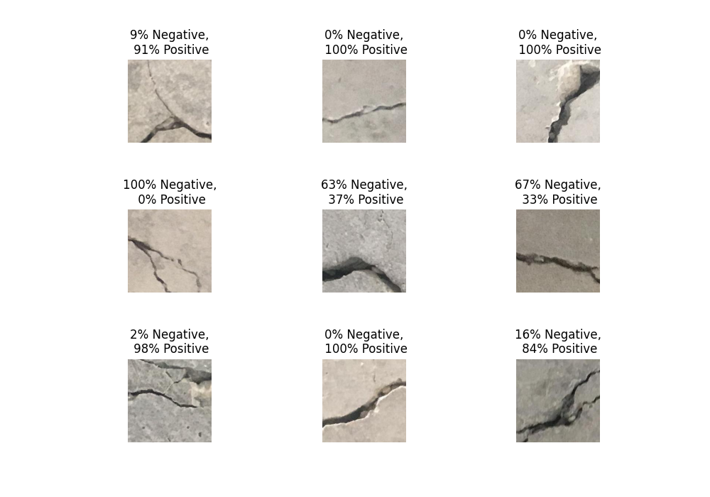
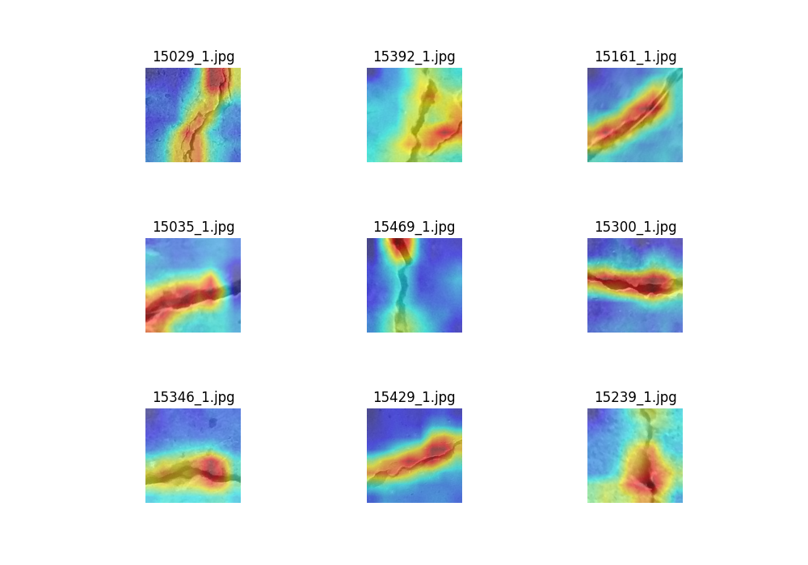

# Surface Crack Classification with Visual explanation using Pytorch

Procedure for Crack classification and Grad-CAM visualization can be found in this <a href="https://medium.com/@raju.monjurulkarim/tutorial-on-surface-crack-classification-with-visual-explanation-part-1-14542d2ea7ac"> Medium</a> article.
 

## Requirements
> Pytorch (>=1.9)
> torchvision (>=0.4)

## Sample classification Results

  

## Sample grad-cam visualization

  

